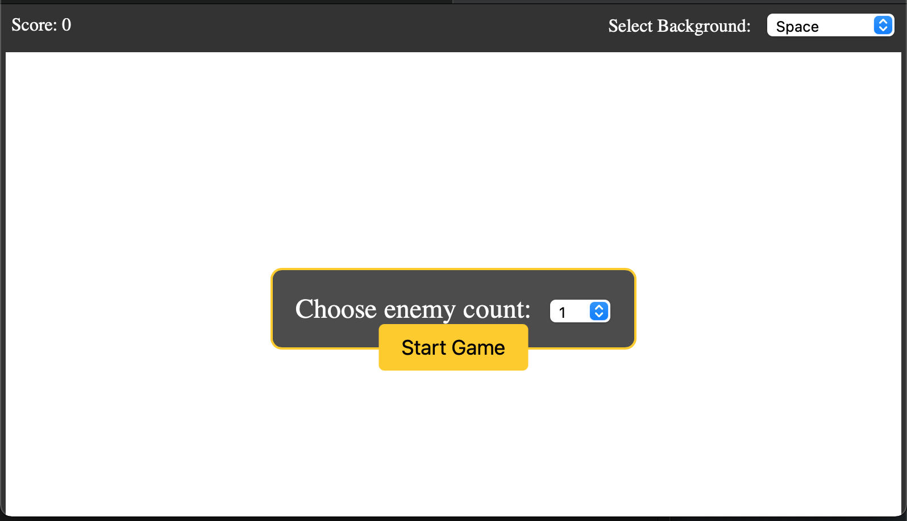
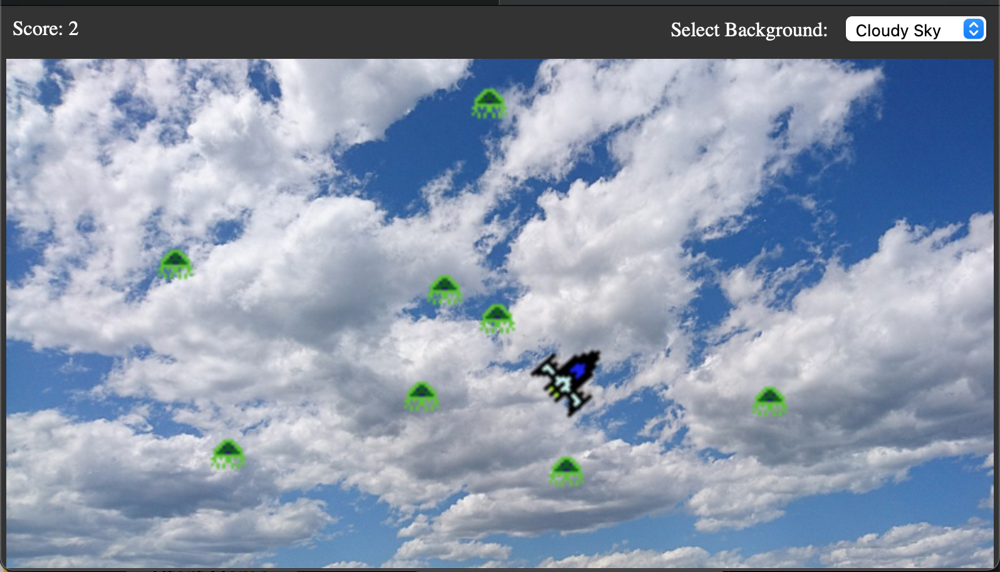

# Asteroids Clone

A simple Asteroids game implemented purely in HTML5 and Vanilla JavaScript. Currently contains multiple settings including enemy density settings, enemy count, and background scenes. 


## Features

- Classic Asteroids gameplay
- Score tracking
- Multiple difficulties (enemy count)
- Background customization
- Responsive design
- Background Music
- Hand drawn pixelart sprites

## How to Play

1. Choose the amount of enemies you would like to have randomly generated
2. Click Start Game in the main menu. 
3. Move the space ship with your cursor to aim. 
4. Shoot the enemies by pressing the spacebar. 
5. Score increments for each enemy destroyed. 
6. (Optional) Change backgrounds with a simple dropdown for whatever scene feels best.  

## Installation

Clone the repository:

```bash
git clone https://github.com/wiljar00/Asteroids_Clone_HTML_JS.git
```

Open the index.html file in your browser while running a live server:
```
cd asteroids-clone/public
open index.html
```

## Screenshots:


